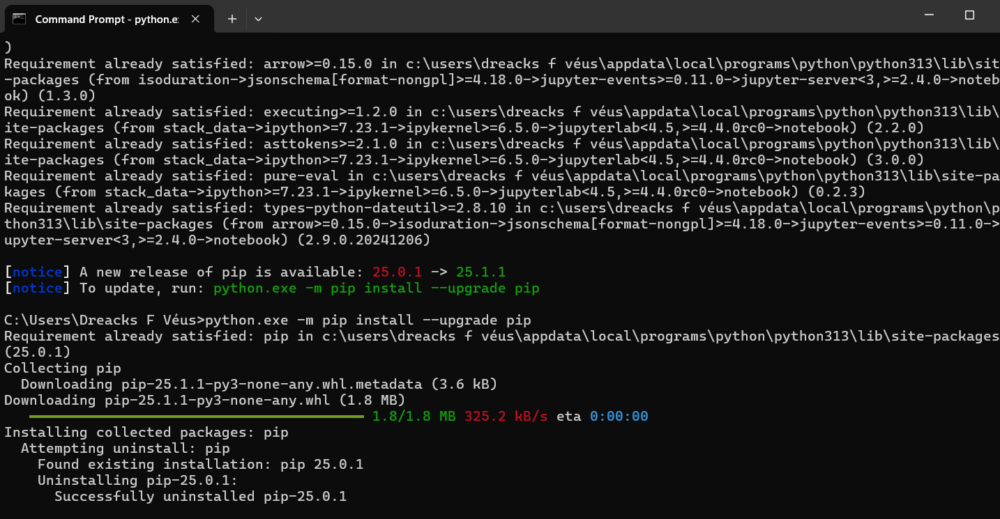
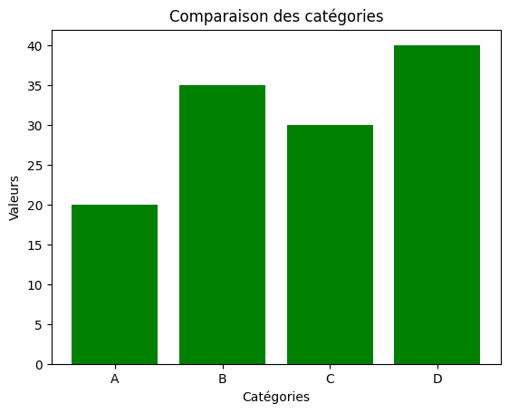

# Institut Universitaire des Sciences - IUS

## Faculté des Sciences et Technologie - FST

### Rapport du Td1 Mathématiques

### Préparé par Marie Beatrice FABIEN

### Soumis au chargé de cours Ismael ST-AMOUR

#### Date Le 02 / 06 / 2025

### Installation de Jupyter notebook


```python





```

    '[]' is not recognized as an internal or external command,
    operable program or batch file.
    


```python

```

Ecrire un programme qui convertit un nombre decimal en hexadecimal en demandant à l'utilisateur de saisir ce nombre


```python
# Conversion d'un nombre décimal en hexadécimal
decimal = int (input ("Entrer un nombre décimal"))
hexad = hex(decimal)
print(f"{decimal} en hexadécimal est {hexad[2:].upper()}")
```

    Entrer un nombre décimal 340
    

    340 en hexadécimal est 154
    

Ecrire un programme qui convertit un nombre hexadecimal en decimal en demandant à l'utilisateur de saisir ce nombre


```python
hexad = input ("Entrer une valeur hexadécimal")
decimal = int(hexad, 16)
print(f"{hexad} en décimal est {decimal}")


```

    Entrer une valeur hexadécimal 3A
    

    3A en décimal est 58
    

Créer un fichier CSV dans Python, charger le et l’afficher


```python
import pandas as pd
# Exemple de données
data = {
"Nom": ["Alice", "Bob", "Charlie", "David", "Eve"],
"Âge": [25, 30, 35, 40, 28],
"Ville": ["Paris", "London", "New York", "Tokyo", "San Francisco"]
}
# Créer un DataFrame
df = pd.DataFrame(data)
# Enregistrer le fichier CSV
df.to_csv("personnes.csv", index=False)
print("Fichier CSV créé avec succès !")

```

    Fichier CSV créé avec succès !
    


```python
df = pd.read_csv("personnes.csv")
print(df.head())
```

           Nom  Âge          Ville
    0    Alice   25          Paris
    1      Bob   30         London
    2  Charlie   35       New York
    3    David   40          Tokyo
    4      Eve   28  San Francisco
    

Code pour générer (5000+lignes) lignes  aléatoires


```python
import pandas as pd
import numpy as np
from faker import Faker
fake = Faker() # Générateur de données aléatoires
# Nombre de lignes à générer
n = 5000
# Générer des données aléatoires
data = {
'ID': np.arange(1, n+1), # ID de 1 à 5000
'Nom': [fake.name() for _ in range(n)], # Noms aléatoires
'Âge': np.random.randint(18, 60, size=n), # Âge entre 18 et 60 ans
'Ville': [fake.city() for _ in range(n)], # Villes aléatoires
'Email': [fake.email() for _ in range(n)], # Emails aléatoires
'Date Inscription': [fake.date_this_decade() for _ in range(n)] # Dates d'inscription
}
# Convertir en DataFrame Pandas
df = pd.DataFrame(data)
# Enregistrer dans un fichier Excel
df.to_excel('grande_base_de_donnees.xlsx', index=False, engine='openpyxl')
print("Fichier Excel de 5000 entrées généré avec succès !")
```

    Fichier Excel de 5000 entrées généré avec succès !
    

Creer 3 graphes

Graphe 1


```python
import matplotlib.pyplot as plt
# Données
x = [1, 2, 3, 4, 5]
y = [10, 20, 15, 25, 30]
plt.plot(x, y, marker='o', linestyle='-', color='r', label="Croissance")
plt.xlabel("Temps (jours)")
plt.ylabel("Valeur")
plt.title("Évolution de la valeur en fonction du temps")
plt.legend()
plt.show()
```


    

    


Graphe 2


```python
categories = ["A", "B", "C", "D"]
valeurs = [20, 35, 30, 40]
plt.bar(categories, valeurs, color='green')
plt.xlabel("Catégories")
plt.ylabel("Valeurs")
plt.title("Comparaison des catégories")
plt.show()
```


    

    


Graphes 3


```python
import matplotlib.pyplot as plt
import numpy as np
from mpl_toolkits.mplot3d import Axes3D
# Générer une grille pour X et Y
x = np.linspace(-5, 5, 100)
y = np.linspace(-5, 5, 100)
X, Y = np.meshgrid(x, y)
# Définir la fonction Z (par exemple, une surface sinusoïdale)
```


```python
Z = np.sin(np.sqrt(X**2 + Y**2))
# Créer la figure et le subplot 3D
fig = plt.figure(figsize=(8, 6))
ax = fig.add_subplot(111, projection='3d')
# Tracer les contours 3D
ax.contour3D(X, Y, Z, 50, cmap='viridis')
# Ajouter des labels et titre
ax.set_xlabel("X")
ax.set_ylabel("Y")
ax.set_zlabel("Z")
ax.set_title("Contours 3D de la fonction Z = sin(sqrt(Xˆ2 + Yˆ2))")
plt.show()
```


    

    


```python

```
